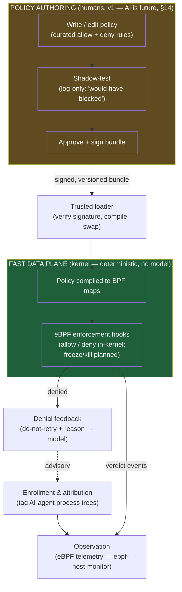
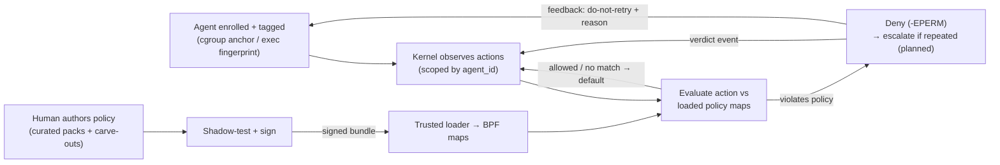
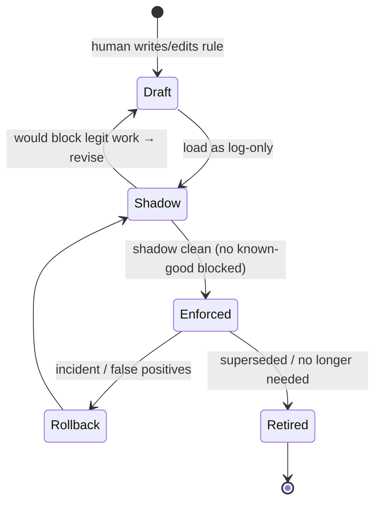

# Architecture — AI Agent Validator

> **Thesis (v1):** Define the policy once. The kernel enforces it on every AI-agent process.
> When it blocks an action, it tells the agent — in terms the *model* understands — that the
> block is **policy, not a transient error**, so the agent stops and re-plans instead of
> hammering the wall. **Deterministic policy in the kernel; no model on the enforcement path.**

This is an open-source project first, with a clear path to a product later. v1 is deliberately
small and sharp: a **policy-strict agent**. Behavior-learning, AI-authored policy, and
intent-vs-action correlation are explicitly **out of v1** and live in §14 (Future directions).

---

## 1. Problem statement

Autonomous AI agents are increasingly given shell access, package managers, network egress,
and credentials on Linux servers. They are useful precisely because they take actions we did
not script in advance — which is also why they are dangerous. A prompt-injected, misaligned,
or simply over-eager agent can `rm -rf`, read secrets, spawn a miner, open a reverse shell, or
pivot laterally, faster than any human can react.

We want to **track AI-agent processes on a Linux host, check their actions against a defined
policy, and block the ones that violate it** — without putting a probabilistic model on the
enforcement path, where its latency and mistakes would be unacceptable.

Two design commitments follow:

- **Enforcement is deterministic and in-kernel.** Policies are **defined and set** (curated
  allow/deny rules). The kernel evaluates an action against pre-loaded rules and returns a
  verdict in microseconds. No model, no network call, no "thinking" on the hot path.
- **Blocks are *communicated*, not silent.** A bare `-EPERM` looks to a model like any other
  failure, so it retries. The novel part of this project is a **feedback channel that tells
  the agent, comprehensibly, "this was a policy block — do not retry"** (§5.6).

Why not a learned baseline (as in the sibling monitor)? Because this is *enforcement*, not
*detection*. A block breaks real work, so it needs a crisp, explainable, deterministic reason
— and agents are novelty machines, so a statistical "normal" is both a poor authorization
boundary and a poisoning risk. Curated policy is the right tool here; learning is an optional
future assist (§14). This mirrors how real eBPF enforcement tools work (Falco rules, Cilium
Tetragon `TracingPolicy`, AppArmor/SELinux profiles) — none block on an ML baseline.

---

## 2. Goals and non-goals

### Goals (v1)

1. **Track only AI-agent processes** — enroll and attribute every action of an agent and its
   descendants, ignoring the rest of the host (§5.1).
2. **Enforce a defined policy in-kernel** — evaluate each action against curated, deterministic
   allow/deny rules and block violations (§5.5, §8, §9).
3. **Communicate blocks to the agent** — emit a structured, model-comprehensible
   "policy-denied, do-not-retry" message so a cooperative agent stops and re-plans (§5.6).
4. **Escalate the uncooperative** *(designed; P3+ delivery)* — repeated violations / terminal
   rules escalate from deny to freeze (Mode-A dedicated cgroup only) to kill (§5.5). Not in the
   initial P3 deny-only rollout.
5. **Audit everything** — every decision and every policy change is logged to a tamper-evident,
   exportable stream (§5.7).
6. **Be safe by construction** — deterministic, signed policy; only a trusted loader writes
   kernel state; scoped blast radius; an explicit fail direction (§10).

### Non-goals (v1)

- **No behavioral learning / baseline as an enforcement source.** Optional future (§14).
- **No LLM authoring policy, no intent-vs-action correlation.** Future (§14). Policy is
  human-defined.
- Not a general EDR/antivirus; scope is **AI-agent workloads** (the mechanism generalizes).
- Not a sandbox/VM-escape boundary on its own — it complements containers, namespaces, seccomp,
  and least-privilege credentials.
- No kernel-rootkit defense; an attacker with kernel code execution is out of scope.

---

## 3. How it works (the model)

Two planes, but in **v1 the slow plane is just a human writing policy**:



The edge that does **not** exist: nothing writes the kernel enforcement maps except the
**trusted loader**, and only for a **signed** policy bundle. The authoring side (a human today,
optionally an AI later) only ever produces *proposals*; it never touches live enforcement.

---

## 4. Relationship to `ebpf-host-monitor` (what we reuse)

The sibling [`ebpf-host-monitor`](../ebpf-host-monitor) is an **observe-only** eBPF agent. We
reuse its *observation* machinery and deliberately **do not** reuse its *learning/baseline* as
an enforcement source.

| Capability | `ebpf-host-monitor` provides | This project's stance |
|---|---|---|
| Kernel telemetry | 15 tracepoints (execve, connect, ptrace, open*, write, setuid/setgid, capset, fork/exit, bind, sendto, oom) → ringbuf | **Reuse** as the observation layer; add per-agent scoping + **argv capture** |
| Enrichment | PID/UID/cgroup → binary/user/container; in-kernel exec filename | **Reuse** |
| MITRE mapping | context-aware ATT&CK + kill-chain | **Reuse** — to explain *why* a rule exists and to seed a curated deny-list |
| Telemetry | OTLP export (spans + logs done; metric instruments *planned*), health `/metrics` | **Reuse** export path; add enforcement-decision stream |
| Persistence | SQLite baseline store | **Reuse pattern** for policy store + version history (not for event storage) |
| Baselining / scoring | 168-bucket seasonal model, z-score/MAD | **Not used for enforcement.** Optional, slow-plane, detection-only — see §14 |

**Key gap the monitor does not cover:** the monitor *watches* (tracepoints fire on
`sys_enter_*`, observational, before the syscall returns). To **block**, we need a kernel
mechanism that returns a deny verdict. **D2 resolved (§9):** LSM + cgroup-BPF egress + tracepoints
(enforce on LSM/cgroup-BPF; observe on tracepoints).

> **Integration:** a **separate `enforcer` daemon** that consumes the monitor's telemetry,
> rather than folding enforcement into the monitor binary — keeps the trusted enforcement path
> small and auditable.

---

## 5. Component architecture

Each unit has one purpose, a defined interface, and is testable in isolation.

### 5.1 Enrollment & attribution (track only AI processes)
A tracepoint fires host-wide, so we must answer "does this action belong to a monitored AI
agent?" There is **no kernel `is-AI` bit**, and process lineage alone can't infer it — a bare
PID's ancestry says "child of X," not "this is AI." AI-ness must be **planted at a known
anchor** and **propagated** to descendants:

- **Anchor (source of truth):** a process we *know* is an agent gets tagged with an `agent_id`.
- **Propagation:** every descendant inherits the tag, via **cgroup membership** (Mode A) or a
  reuse-safe **process-lineage** walk (`(pid, start_ns)` proctable) recorded in a tagged-PID
  map (Mode B). The agent is the lineage root; a `bash → curl → sh` chain it spawns is all
  attributed to it.

Enrollment is **hybrid** (resolves **D1**), so users never change how they launch their agent:

| Mode | When | How the anchor is planted | Propagation / enforcement |
|---|---|---|---|
| **A — controlled spawn** | We own the host image / launch infra (CI, devcontainers, sandboxes, systemd units) | Bake cgroup placement into the entrypoint (`Slice=ai-agents.slice` / container init); inheritance does the rest | Dedicated cgroup → cgroup-BPF egress **and** LSM apply; blast-radius = the slice |
| **B — eBPF exec-time fingerprint** | We don't control the launch (developer just runs `claude`) | BPF on the **`sched_process_exec` tracepoint** matches **binary identity** (inode/path) + **env/argv markers**, writes the PID-tree into a tagged map | Shared cgroup → propagate via **tagged-PID/lineage map**; enforce via **LSM keyed on that map** (cgroup-BPF egress does not apply) |

Mode-B detection notes:
- **Hook choice:** use `sched_process_exec` (always available) — **not** the `bprm_check` LSM
  hook — so enrollment (P0) does **not** require `CONFIG_BPF_LSM`/`lsm=bpf`. Enforcement (P3)
  does (§9). (`bprm_check` is fine for *binary identity*, not for argv/env strings, which live
  in the new `bprm->mm`, not `current->mm` yet.)
- **Markers are a bounded-prefix scan:** env/argv markers (e.g. `CLAUDECODE` /
  `CLAUDE_CODE_ENTRYPOINT`, `CURSOR_*`) are read with a bounded `bpf_probe_read_user` scan; the
  env block is **unindexed**, so a marker past the scan window is missed. **Binary identity
  (inode/path) is the required backstop** — a bare name like `codex` is a common word and
  FP-prone.
- **Markers are agent-controlled** (inherited, removable) — they speed detection but cannot be
  trusted alone (§11 enrollment-evasion).
- **Mode-A hardening:** lock cgroup delegation so a tagged agent can't write its own
  `cgroup.procs` and migrate out of the slice to shed attribution.

**Default: Mode B everywhere, Mode A wherever we control the environment.** The fingerprint set
is operator-maintained — a finite, known-agent list, never a per-user burden. Fundamental
tradeoff (unavoidable): you can't have *transparent + zero-list + reliable* simultaneously.

- **Interface out:** `agent_id` tag per in-scope process; untagged processes are ignored.

#### 5.1.2 Fingerprint authoring & distribution (Mode B)
A fingerprint is **data, not code** — an entry the loader pushes into the match set, shipped as a
signed, versioned pack (same plumbing as policy) and hot-reloadable. Each entry's `match` block is
the **AND** of all non-empty conditions:

```yaml
- id: claude-code
  agent_id: claude-code
  identity_class: interpreted     # interpreted | compiled
  confidence: high
  match:
    interpreter_basename: node    # basename of the resolved binary
    interpreter_path: ""          # exact resolved path (strong signal for compiled agents)
    argv_contains: ["*/cli.js"]   # every glob must match an argv element ('*' spans any chars)
    env_markers: { any_of: [CLAUDECODE, CLAUDE_CODE_ENTRYPOINT] }  # >=1 env var NAME present
```

The decisive subtlety: most agents are **interpreted** (Claude Code, Cursor run as `node`), so the
kernel-visible binary is the interpreter and the real discriminators are `argv` + `env_markers`;
`interpreter_path` is the strong signal only for **compiled** agents. argv/env are read as a
**bounded prefix** (§5.1.1), so markers must be early and unique, and a bare common name (`node`)
is never sufficient alone. Distribution is two-tier: a **curated community pack** for well-known
agents (the main contribution surface) plus **local entries** for in-house agents. Onboarding a
new agent is observe → derive a stable/unique tuple → shadow-test recall (whole subtree tagged) and
precision (no unrelated process tagged) → ship.

> **P0 implementation note.** v1's first milestone is a **self-contained agent** (it ports the
> `ebpf-host-monitor` patterns rather than importing them). In P0, enrollment and fingerprint
> matching run in **userspace** off the exec/fork/exit event stream, and the `agent_id` tag is held
> in a userspace process table; the **in-kernel tag map** (needed to key fast LSM enforcement)
> arrives with enforcement in P3. P0 is observe-only.

### 5.2 Observation layer
- **What:** eBPF programs + userspace enricher producing a structured event stream of tagged
  agent actions (exec, file, network, privilege, lifecycle).
- **Source:** reuse `ebpf-host-monitor` (§4). Observation is via **tracepoints** — they watch,
  they cannot block (blocking is §5.5/§9).
- **Command capture (P0):** rules match on command *arguments* (which URL/path/flags), not just
  the binary. Capture argv at `sys_enter_execve`/`execveat` via a bounded `bpf_probe_read_user`
  scan (a **bounded prefix** of argv; userspace re-resolves full paths). The monitor captures
  `comm` + exec filename today but not full argv — this project requires it.
- **Interface out:** enriched, `agent_id`-tagged event records.

### 5.3 Policy model (defined & set)
- **What:** the curated, deterministic allow/deny rules the system enforces — the heart of v1.
  Authored by humans, expressed in the schema of §8, compiled to BPF maps.
- **Shape:** a **generic curated core** (agent- and host-independent deny rules for the
  catastrophic, stable set — credential reads, privesc, persistence, public egress, destructive
  writes/deletes to **system paths** (`/etc`, `/boot`, `/usr`, `/bin`, `/lib`, …), disabling the
  enforcer) **+ small per-environment carve-outs** (this build agent may reach *that* internal
  registry).
- **Deliberately *not* deny-listed:** arbitrary user/workspace file deletion. Agents legitimately
  create and delete files constantly, so a blanket `rm` deny would break normal work; the core
  protects **system-critical paths**, not the agent's own working tree. (A workspace-confinement
  carve-out is a per-environment option, not a generic rule.)
- **Distribution:** policy is a signed, versioned bundle. Curated **policy packs** (e.g. a
  generic agent pack) ship with the project; operators add carve-outs. (Maintained packs are
  the natural commercial layer later — §14.)

### 5.4 Policy loader (trusted userspace)
- **What:** a small, auditable daemon — the **only writer to the enforcement maps**. It verifies
  the bundle signature, compiles the declarative policy (§8) into concrete BPF map entries,
  atomically swaps them in, keeps version history, and supports instant rollback.
- **Why separate:** keeps the trusted computing base tiny. Everything that *produces* policy is
  upstream of it.
- **Deployment (D6 resolved):** open-source **v1 ships single-host** — author, sign, and load on
  the same machine. The loader accepts signed bundles from a **pluggable source** (local file in
  v1; HTTP/Git/S3/fleet-push later) so a future host-management platform can distribute policy
  without changing the loader/enforcer contract. Kernel enforcement is always local; fleet only
  changes *how the bundle arrives*. Policed hosts hold the **public** verification key only;
  the signing private key stays on the authoring side (§10).

### 5.5 Enforcement layer (fast data plane)
- **What:** eBPF programs on enforcement-capable hooks that read the policy maps and return
  **allow/deny** verdicts (and signal userspace/escalate where a pure deny is insufficient).
- **Mechanism (D2 resolved):** **LSM + cgroup-BPF egress + tracepoints** (§9). LSM for
  file/exec/privilege (and Mode-B egress); cgroup-BPF for Mode-A egress; tracepoints for
  observation only.
- **Actions (D3 resolved):** full set designed — syscall/file/exec deny, network egress block,
  freeze/kill/quarantine — but **v1 P3 ships deny-only** (`-EPERM`). Escalation ladder and
  terminal `decision: kill` rules are **planned** for a follow-on phase.
- **What "deny" does:** an LSM hook returns **`-EPERM`** — the *action* fails; the process is
  **not** auto-killed. Deliberate: most violations should block the action and let the agent
  continue (and receive feedback, §5.6).
- **Escalation ladder** *(planned — not in v1 P3 deny-only rollout)*:
  1. **Deny** (`-EPERM`) — default, in-kernel; **ships in P3.**
  2. **Repeated denial** → **freeze** the agent's cgroup. `cgroup.freeze` is a **cgroup-v2
     userspace** action (BPF *detects* the repeat; the trusted enforcer writes the freeze).
     Clean for a dedicated Mode-A slice only.
  3. **Kill / quarantine** via `bpf_send_signal()` (SIGKILL) — targets the **current task** (the
     offender, in whose context the deny hook runs; it cannot target an arbitrary PID) — or via
     the userspace enforcer for whole-tree kill. **Mode B (shared cgroup):** no freeze — escalate
     straight to kill when the ladder is enabled (attackers may not spawn agents as expected).
  4. **Terminal rules:** a rule may set `decision: kill` to skip deny and kill immediately on
     match (e.g. enforcer tampering) — *planned*, not P3.
- **Hard rule:** these programs never call userspace synchronously for a verdict and never
  consult a model. Verdicts come only from pre-loaded maps. **Action-only:** a verdict is a
  function of observed action + approved policy alone.

### 5.6 Denial feedback channel (the interesting part)
- **Problem:** a denied syscall returns a bare `-EPERM`, indistinguishable to the model from a
  missing file or a network blip — so a naive agent **retries forever**. Most "AI doing
  something bad" is not a malicious attacker; it's a **confused or over-eager legitimate
  agent**. For that (common) case, comprehensible feedback genuinely changes behavior: the model
  reads "blocked by policy, don't retry" and re-plans. For the truly adversarial case, feedback
  is useless and the escalation ladder (§5.5) is the answer. We design for both.
- **What:** when the enforcer denies an action, it emits a structured **policy-decision record**
  that the agent runtime surfaces back into the model's context (tool result / system message /
  structured stderr):

  ```json
  {
    "decision": "denied",
    "action": "connect",
    "target": "203.0.113.9:443",
    "matched_rule": "deny-egress-except-registry",
    "reason": "Outbound connections to public IPs are blocked by host policy for AI agents. The internal package registry (10.0.0.0/8) is allowed.",
    "retry": "do-not-retry",
    "nature": "hard-policy (not a transient error)",
    "appeal": "If this is genuinely required, a human must change the policy; you cannot bypass it."
  }
  ```

- **Delivery options (by how much we control the agent):**
  - *We control the runtime/shim:* inject as a tool result or system message (cleanest — the
    model sees it inline).
  - *We don't:* wrap the `-EPERM` with a message via a thin shim, or expose a well-known
    file/FD/socket the agent's shell surfaces, so the explanation rides alongside the errno.
- **How it routes:** enforcer → feedback bus → agent runtime hook → model context. The kernel
  deny carries only pid/cgroup; userspace attaches the human-readable `reason` (sourced from the
  matched rule's `rationale`, §8) and resolves the owning `agent_id`. Nothing on the hot path
  depends on this channel.
- **Trust posture:** **advisory, best-effort, one-directional.** It *informs* the model; it
  never relaxes enforcement. Cooperative agent → stops and re-plans. Uncooperative/compromised
  agent → ignores it and hits the escalation ladder. Comprehension is offered, never required,
  and we never depend on the policed party behaving well.

### 5.7 Audit, telemetry & observability
The data path mirrors `ebpf-host-monitor`: **ringbuf in, push out, state-only on disk.**

1. **Kernel → userspace via BPF ringbuf** — agent actions *and* enforcement verdicts
   (allow/deny/freeze/kill); variable-length, backpressure via drops, single consumer.
2. **Userspace enriches** — PID/UID/cgroup → binary/user/container, `agent_id`, argv.
3. **Local persistence = state only** — **SQLite** holds **policy version history**; it is
   **not** a full event log. The host stays effectively stateless for events.
4. **Export = push, via OpenTelemetry (OTLP gRPC):**
   - **Logs** — structured security LogRecords; primary audit/SIEM path. Every high-value action,
     **every enforcement decision**, and **every policy change** goes here, at **100% sampling**.
   - **Traces** — enforcement-decision spans, kill-chain spans (reused).
   - **Metrics** — deny rate, escalations, agent task-failure rate (net-new instruments; the
     monitor's OTLP metrics are still *planned*, so don't assume reuse).
5. **Prometheus `/metrics` = pull, health only** — agent up, ringbuf drops, hooks attached.

> **Audit-durability caveat:** verdict records share the ringbuf, so under extreme backpressure
> `bpf_ringbuf_reserve` can drop one *before* the export/audit paths see it — the deny still
> applies (`-EPERM`), but its record is lost. Use a **reserved/separate ringbuf channel** for
> verdicts so the "100% / never sampled away" guarantee holds; absent that, verdict audit is
> **best-effort** under extreme load.

**Tamper-evident local audit log (net-new):** enforcement decisions and policy changes also
append to a **local, integrity-protected, append-only log** that survives a collector/network
outage and flushes on recovery.

**Where "everything" lives:** the **backend** (SIEM / Loki / Tempo / ClickHouse) the collector
fans out to. Full-event retention is a backend concern, not a host concern.

> **Retention default (overridable):** push-only via OTLP + local audit log; SQLite for state
> only. An optional local full-event sink (for air-gapped hosts) is off by default.

### 5.8 Policy authoring & lifecycle (humans, v1)
- **What:** the human workflow that produces a signed bundle — write/edit rules, **shadow-test**
  (log-only "would have blocked" against live traffic), approve, **sign**.
- **No AI here in v1.** The slow control plane is a person plus the curated packs. (AI authoring,
  learning-based allow-list generation, and auto-promotion are §14.)
- **Lifecycle:** see §7.

---

## 6. End-to-end flow



Two independent loops: a **fast runtime loop** (observe → evaluate → deny/feedback) that runs
without humans, and a **slow authoring loop** (write → shadow → sign → load) that humans drive
on their own schedule.

---

## 7. Policy lifecycle (state machine)



| State | Kernel behavior | Advanced by |
|---|---|---|
| **Draft** | none | author |
| **Shadow** | log-only ("would have blocked") | author, after writing |
| **Enforced** | actively blocks in scope | author/operator, after clean shadow |
| **Rollback** | revert to previous signed bundle instantly | operator (manual or alert-triggered) |
| **Retired** | removed | loader |

New deny rules are **shadow by default** — you see what a rule *would* block against real
traffic before it can break anything.

---

## 8. Policy representation (deterministic, human-readable)

Policy is a **declarative, signed, versioned bundle** — the contract between the author and the
kernel. Expressive enough for humans (and later tools) to target, simple enough to compile to
BPF maps unambiguously:

```yaml
policy_bundle:
  version: 7
  agent_scope: "agent:ci-runner"        # cgroup / label / tag selector (§5.1)
  signed_by: "ops-team"                 # signature over the whole bundle
  default_action: allow                 # deny-list posture (see below)
  fail_direction: open                  # operator choice: open | closed (§10)
  rules:
    - id: deny-egress-except-registry
      rationale: >
        AI agents on this host must not reach public IPs. The internal package
        registry (10.0.0.0/8:443) is the only allowed egress.
      match:
        action: connect
        dest_ip_not_in: ["10.0.0.0/8"]
      decision: deny
      state: enforced

    - id: deny-cred-file-read
      rationale: "AI agents never need /etc/shadow or SSH private keys."
      match:
        action: open
        path_in: ["/etc/shadow", "/root/.ssh/*", "/home/*/.ssh/*"]
      decision: deny
      state: enforced

    - id: deny-disable-enforcer
      rationale: "Agents must not tamper with the enforcer/monitor or its policy."
      match:
        action: open|write|unlink
        path_in: ["/etc/ai-agent-validator/*", "/sys/fs/bpf/ai-agent-validator/*"]
      decision: deny
      state: enforced

    # Terminal kill rules are planned (not v1 P3 deny-only rollout):
    # - id: terminal-enforcer-tamper
    #   rationale: "Immediate termination on enforcer tamper attempts."
    #   match: { action: write|unlink, path_in: ["/etc/ai-agent-validator/*"] }
    #   decision: kill
    #   state: enforced

    - id: deny-destroy-system-paths
      rationale: >
        Agents must not write to or delete OS-critical paths (a confused `rm -rf`
        on a system dir). Their own workspace is intentionally NOT covered here.
      match:
        action: write|unlink|rename
        path_in: ["/etc/*", "/boot/*", "/usr/*", "/bin/*", "/sbin/*", "/lib/*"]
      decision: deny
      state: enforced

    - id: shadow-new-egress-port
      rationale: "Surface unusual egress ports before blocking them."
      match:
        action: connect
        dest_port_not_in: [443, 80]
      decision: deny
      state: shadow          # log-only until promoted
```

Design constraints:
- **Closed vocabulary of match fields** — only what the kernel can evaluate from map data
  (action type, dest ip/port, path prefixes, uid, binary identity, cgroup). No regex / no
  free-form predicates on the hot path.
- **Every rule carries a rationale** — it is the human-readable text shown to operators *and*
  reused verbatim as the denial-feedback `reason` (§5.6).
- **Compilable to maps** — path sets → LPM/hash, IP ranges → LPM trie, ports → hash, binary
  identity → hash of path/inode. No interpretation at runtime.

**Allow vs. deny semantics.** eBPF LSM hooks can only **restrict** — they deny on top of
DAC/MAC; they cannot *grant* an action the OS would otherwise refuse. So `decision: allow` is a
**carve-out that suppresses a broader deny** (e.g. "deny all egress *except* the registry").
Two postures via `default_action`:
- `allow` (**deny-list** — recommended default): kernel allows unless a `deny` rule matches.
  Low false-positive risk; misses novel-but-bad until a rule exists. Best fit for agents'
  novelty and for availability.
- `deny` (**allow-list / default-deny**): stronger containment, but the allow-list must be
  complete or the agent breaks. Pair with `fail_direction: closed` (§10). This is the posture
  that would later benefit from learning-assisted allow-list generation (§14).

**Rule `decision` vocabulary.** `allow` (carve-out), `deny` (block action, `-EPERM`) — **v1
P3**. `kill` (terminal rule, immediate termination on match) — **planned**, not P3. Freeze and
repeat-denial escalation are runtime behaviors (§5.5), not per-rule `decision` values.

**Conflict resolution.** Deterministic precedence: **deny wins over allow**; among same-decision
rules the **most specific match wins** (longest-prefix path / narrowest IP range); `shadow`
rules never affect the live verdict. The compiler rejects bundles it can't order unambiguously,
so the kernel never resolves a tie at runtime.

---

## 9. Enforcement mechanics (kernel) — D2 resolved

**Chosen mechanism:** **(e) LSM + cgroup-BPF egress + tracepoints** — enforce on LSM and
cgroup-BPF; observe on tracepoints (reuse `ebpf-host-monitor`).

| Layer | Mechanism | Role |
|---|---|---|
| File / exec / privilege | **eBPF LSM (KRSI)** — `BPF_PROG_TYPE_LSM` | Return negative errno (e.g. `-EPERM`) from hooks (`file_open`, `bprm_check_security`, `socket_connect`, `inode_unlink`, `inode_rename`, `file_permission`, …) to deny |
| Network egress (Mode A) | **cgroup-BPF** — `cgroup/connect4\|6` | Per-dedicated-cgroup egress deny at `connect()`; sees dest IP/port. Optional `cgroup/sock_create` for socket-*type* restrictions (no dest IP yet). |
| Network egress (Mode B) | **LSM `socket_connect`** keyed on tagged-PID map | Per-agent egress on shared cgroups |
| Telemetry | **tracepoints** | Observation only — cannot block |
| Escalation fallback *(planned)* | **`bpf_send_signal()`** / userspace kill / cgroup freeze | Kill/quarantine when deny is insufficient; freeze is a **userspace** `cgroup.freeze` write (Mode A only) |

**Kernel requirements:** kernel ≥ 5.7, `CONFIG_BPF_LSM`, boot param `lsm=...,bpf`, cgroup v2
(for Mode-A egress and planned freeze).

> **Egress differs by enrollment mode:** cgroup-BPF egress applies only to a **dedicated
> (Mode-A) cgroup**. For a shared **Mode-B** agent, egress denial rides the **LSM
> `socket_connect` hook keyed on the tagged-PID map** instead.

**Alternatives not chosen:** seccomp-bpf (syscall-number granularity; poor path/IP matching;
spawn-time install); observe-and-kill via tracepoints alone (racy — containment, not prevention);
LSM-only without cgroup-BPF (works, but cgroup-BPF is cleaner for Mode-A egress).

Hot-path rules regardless of mechanism:
- Verdicts come **only** from pre-loaded maps written by the trusted loader (§5.4).
- No synchronous userspace upcall for routine verdicts. `SECCOMP_RET_USER_NOTIF` is **not** a
  safe synchronous gate for argument-dependent denies (TOCTOU on dereferenced pointer args), so
  it's only for coarse, non-racy decisions with a safe default.
- Bounded work, no unbounded loops — verifier limits (bounded loops since 5.3; ~1M-instruction
  complexity cap).

---

## 10. Trust & safety model

What makes "block AI actions on my server" defensible:

1. **Only the trusted loader writes enforcement state.** Authoring (human, or AI later) produces
   data; the loader (§5.4) is the sole writer, and only for **signed** bundles.
   - **TCB caveat (critical):** this holds only if nothing else can write the maps. Any process
     with `root`/`CAP_BPF`/`CAP_SYS_ADMIN` can `bpf()` directly and bypass it. Mitigations: **(a)**
     the policed agent must **not** have `CAP_BPF`/root (it's the policed party, not the TCB);
     **(b)** pin maps under a restricted bpffs path owned by the loader; **(c)** optionally gate
     the `bpf` syscall via a BPF-LSM hook so only the loader may mutate policy maps; **(d)** treat
     host root as inside the TCB. We defend against the *agent*, not a host-root attacker.
2. **Shadow-by-default.** New deny rules log-only first; you see what they'd block against real
   traffic before they can break work.
3. **Signed, versioned policy.** Every bundle is signed; the loader verifies before load; every
   version is retained for instant rollback. **Signing-key custody** is part of the TCB — the
   private key lives only on the authoring host (ideally HSM/TPM/KMS), never on monitored hosts;
   the loader ships only the public key. Key compromise = policy compromise.
4. **Fail direction is operator-configurable (D5 resolved).** Each policy bundle sets
   `fail_direction: open|closed` per `agent_scope` — not a project-wide default imposed on
   operators:
   - *Fail-open:* if the enforcer/loader dies or enforcement maps are unavailable, enrolled-agent
     actions are allowed (lose protection, keep availability).
   - *Fail-closed:* deny enrolled-agent actions on uncertainty (lose availability, keep
     containment). Pair with `default_action: deny` and careful carve-outs.
   - **Implementation:** an `enforcement_active` flag in pinned BPF maps; **LSM hooks and
     cgroup-BPF programs** for tagged agents apply the scope's `fail_direction` when the flag is
     clear or maps are missing. Untagged host processes are never affected.
5. **Blast-radius limits.** Enforcement is scoped to the agent's cgroup/tag, not the whole host,
   so a bad rule can't brick unrelated services.
6. **Tamper-evidence.** Policy store and audit log are integrity-protected; map writes are
   logged; state files are root-owned `0600` (inherited hardening).

---

## 11. Threat model (summary)

| Threat | Handled by | Residual risk |
|---|---|---|
| Over-eager/prompt-injected agent runs a destructive command | Enforcement deny rules (incl. system-path protection) + comprehensible feedback so it stops | Only for actions an enforced rule covers; a novel bad action with no matching rule is allowed under deny-list default (see the "deny-list misses novel bad" row) |
| Agent reads secrets / exfiltrates over network | Credential-file deny + egress deny-list | DNS/covert channels (no payload inspection) |
| Agent escalates privilege | setuid/capset/sudo deny rules | Kernel-level exploits out of scope |
| Agent tampers with the enforcer/policy | Deny rules on enforcer paths + signed policy + loader-only map writes | Host-root attacker is in the TCB — out of scope |
| Policed agent writes enforcement maps directly | Agent runs without `CAP_BPF`/root; loader-owned pinned maps; optional BPF-LSM `bpf()` gating | Host-root attacker — out of scope |
| Agent evades enrollment (no controlled cgroup, no matching fingerprint) | Mode A where possible; maintained fingerprint set for Mode B; untagged exec of known markers alerts | A never-fingerprinted agent launched outside controlled infra is unmonitored until added |
| Denied agent retries in a loop | Deny + denial feedback (§5.6); planned escalation → freeze/kill (§5.5) | Until escalation ships, a compromised agent ignoring feedback burns cycles on `-EPERM` |
| Deny-list misses a novel bad action | `default_action: deny` posture (allow-list) for high-security scopes; shadow rules surface novelty | Deny-list inherently blocks only known-bad; this is the accepted v1 tradeoff |
| Attacker tampers with policy in transit/at rest | Signature verification, integrity-protected store | Compromise of the signing key |
| Kernel rootkit hides actions | — | Out of scope |
| Enforcer crashes | Operator-chosen `fail_direction` per scope (§10) | Per configured regime |

---

## 12. Architectural decisions (resolved)

| ID | Decision | Resolution |
|---|---|---|
| **D1** | Enrollment | **Hybrid** — Mode A (controlled-spawn cgroup) + Mode B (exec-time fingerprint). §5.1. |
| **D2** | Kernel enforcement mechanism | **LSM + cgroup-BPF egress + tracepoints.** §9. |
| **D3** | Enforcement actions | **Full set designed; v1 P3 ships deny-only.** Escalation ladder (freeze/kill/quarantine) and terminal `decision: kill` rules are **planned** for a follow-on phase. Mode B skips freeze (kill-only when escalation lands). §5.5. |
| **D4** | LLM location | **Deferred** — irrelevant until/unless LLM-assisted allow-list generation is built (§14, distant-future, lowest priority). |
| **D5** | Fail direction | **Operator config** — `fail_direction: open\|closed` per bundle/`agent_scope`. §8, §10. |
| **D6** | v1 deployment scope | **Single-host for open-source v1**; loader/enforcer contract is **fleet-ready** (pluggable bundle source; no host-management platform required in v1). §5.4, §13. |

---

## 13. Phased build plan (v1)

Sequenced so each phase is independently useful; enforcement comes only after tracking and
policy plumbing are solid.

| Phase | Deliverable | Reuses | New |
|---|---|---|---|
| **P0 — Enroll & observe** | Hybrid enrollment (Mode A cgroup + Mode B exec fingerprint); per-`agent_id` action stream; **argv capture** | `ebpf-host-monitor` | enrollment/attribution (§5.1), `agent_id` tag map, argv |
| **P1 — Policy model + loader** | Policy schema (§8); signed bundle; trusted loader (local file source; pluggable for fleet); compile to BPF maps; version history + rollback | SQLite pattern | policy compiler/loader (§5.4) |
| **P2 — Shadow mode** | Load rules log-only; "would have blocked" reporting against live traffic | OTLP audit | shadow evaluation, policy lifecycle (§7) |
| **P3 — Enforce** | LSM + cgroup-BPF (§9); **deny-only** (`-EPERM`) for file/exec/network/privilege | — | enforcer (§5.5) |
| **P4 — Denial feedback** | Structured do-not-retry + reason surfaced into the model's context; shim/runtime integration | — | feedback channel (§5.6) — *the differentiator* |
| **P3+ — Escalation** *(planned)* | Repeat-denial → freeze (Mode A) / kill (Mode B); terminal `decision: kill` rules; quarantine | — | escalation ladder (§5.5) |
| **P5 — Curated packs + ops** | A generic agent deny-list pack; carve-out config; full audit/observability | monitor OTel/MITRE | policy packs, ops tooling |

Curated deny rules (P5) can be seeded early from the monitor's MITRE mapping. **No learning
phase is required to ship enforcement.**

---

## 14. Future directions (post-v1, by priority)

Nothing in v1 depends on anything here. Listed highest- to lowest-priority; the AI/learning idea
is deliberately **last** — a distant-future "nice to have," not a near-term goal.

**Near-term, deterministic (no model):**
- **Automated promotion gate.** Staged rollout (shadow → canary → enforce) with objective gates
  (no false-positive blocks of known-good over N hours, no rise in agent task-failure rate).
- **Anomaly-detection alert stream (detection-only).** Reuse the monitor's scorer to surface
  unusual agent behavior to operators — an alert/telemetry signal, **never** an enforcement input.
- **Intent capture & correlation (detection-only).** Optionally ingest the agent's declared
  task/plan and flag intent-vs-action divergence as an alert that *proposes* rules — **never** an
  enforcement input (self-reported intent is untrusted; fuzzy NL matching has no place on a
  deterministic hot path).

**Planned — distant future, lowest priority** (the only place AI would re-enter the control plane):
- **Learning/LLM-assisted allow-list generation.** *Lowest-priority; revisit only once the
  deterministic product is mature.* Relevant only if the strong-containment posture
  (`default_action: deny`) is ever offered: observe legitimate behavior and **propose** an
  allow-list (optionally an LLM drafting candidate rules + rationale from MITRE context) for a
  human/gate to approve — addressing the "allow-list is tedious to hand-write" adoption barrier.
  Hard constraints: output is always a *proposal*; the model is strictly **upstream of the
  loader** and never writes maps or touches the enforcement path. **D4** (where the LLM runs) only
  becomes relevant here.
  - *Explicitly not planned:* using an LLM to author the catastrophic **deny**-list — curated,
    human-owned, community-maintained packs are more trustworthy for the stable,
    security-critical core.

**Commercial framing (later):** open core = mechanism + generic curated packs; paid = maintained
packs, management/gate UI, and — eventually — the allow-list-generation assist above.

---

## 15. Component boundary summary

| Unit | Does | Used by | Depends on | Plane |
|---|---|---|---|---|
| Enrollment & attribution | tags agent process trees (anchor + propagation) | observation, enforcer | cgroup, eBPF exec hook, fingerprint set | data |
| Observation | emits enriched, tagged agent-action events (incl. argv) | enforcer, audit | kernel eBPF, `ebpf-host-monitor`, enrollment | data |
| Policy model | curated allow/deny rules | loader | human authors, curated packs | authoring |
| Policy loader | verify + compile + load signed policy to maps | enforcer | signed bundle | trusted |
| Enforcer | v1 P3: in-kernel deny; P3+ planned: freeze (userspace) / kill | feedback, audit | loader (maps only) | data |
| Denial feedback | returns do-not-retry + reason to the model | agent runtime / model | enforcer, rule rationale | cross (advisory) |
| Audit/observability | records decisions + policy changes | humans, backends | all of the above | cross |

---

## 16. Glossary

- **Policy-strict** — enforcement is driven entirely by defined, deterministic rules; no model
  or learned baseline on the decision path.
- **Fast data plane** — the in-kernel enforcement side; deterministic, microsecond-scale.
- **Enrollment** — planting the "this is an AI agent" tag at a known anchor (controlled-spawn
  cgroup, or eBPF exec-time fingerprint) so attribution propagates to descendants.
- **Anchor / propagation** — the anchor is the known-agent process; propagation spreads its
  `agent_id` to descendants via cgroup membership (Mode A) or reuse-safe lineage (Mode B).
- **Fingerprint set** — the operator-maintained list of known-agent binary identities + env/argv
  markers used by Mode-B enrollment.
- **Policy bundle / pack** — signed, versioned set of deterministic rules (§8); a "pack" is a
  curated, shippable bundle.
- **Denial feedback** — the advisory reverse signal (`do-not-retry` + human-readable reason) sent
  to the model after a block (§5.6); the project's differentiator.
- **Shadow mode** — a rule is evaluated and logged ("would have blocked") but does not enforce.
- **KRSI** — Kernel Runtime Security Instrumentation; eBPF programs on LSM hooks.
- **Quarantine** — containment beyond a single deny: freeze (Mode A) or kill (Mode B) plus audit
  lock; planned for P3+, not v1 P3.

---

*Status: design decisions D1–D3, D5–D6 resolved (§12); D4 deferred to §14. v1 = policy-strict
enforcement (deny-only in P3) + model-comprehensible denial feedback. Single-host deployment;
fleet-ready bundle contract. Builds on `ebpf-host-monitor` for observation; learning/AI authoring
are explicitly future (§14).*
