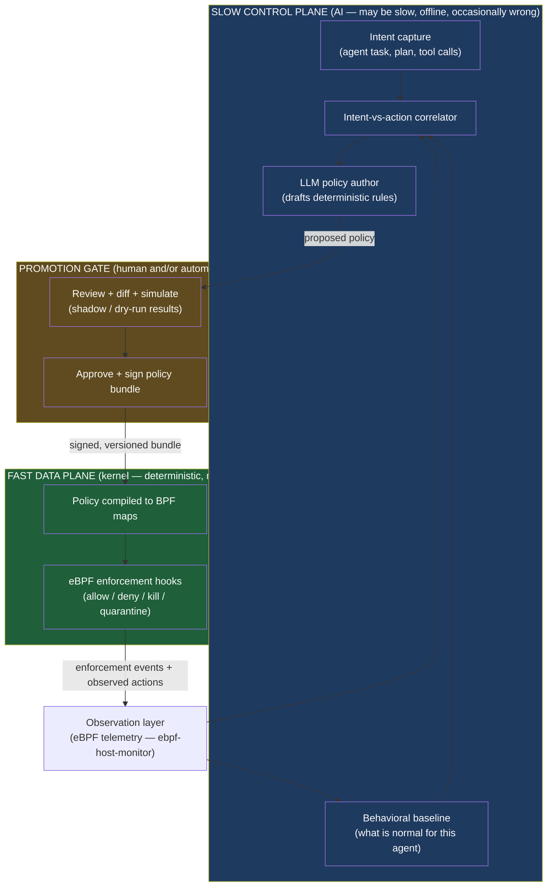
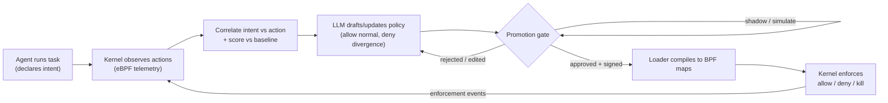
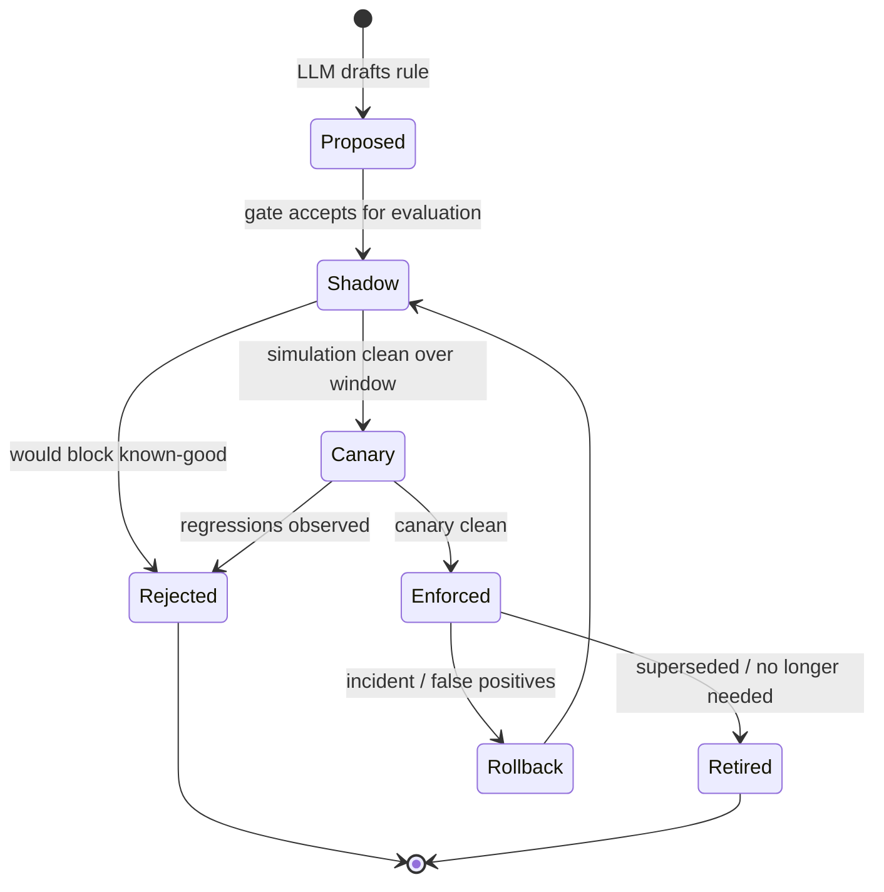

# Architecture — eBPF AI-Action Blocker

> **Thesis:** AI in the slow control plane, deterministic rules in the fast data plane.
> The LLM watches behavior, correlates *intent* against *action*, learns what is normal,
> and **drafts** policy. A human (or a promotion gate) **approves** it. Then the kernel
> **enforces** it with no LLM in the loop. **AI writes the rules; the kernel runs them.**

---

## 1. Problem statement

Autonomous AI agents are increasingly given shell access, package managers, network
egress, and credentials on Linux servers. They are useful precisely because they take
actions we did not script in advance — which is also why they are dangerous. A
prompt-injected, misaligned, or simply confused agent can `rm -rf`, exfiltrate secrets,
spawn a crypto miner, open a reverse shell, or pivot laterally, and it can do so faster
than any human reviewer can react.

We want to **monitor AI agent actions on Linux hosts and block the suspicious ones** —
without (a) putting a probabilistic model on the critical enforcement path, where its
latency and hallucinations would be unacceptable, or (b) hand-writing an exhaustive
allow/deny list for behavior that is, by design, open-ended.

The resolution is a **two-plane split**:

- **Slow control plane (AI):** observes, reasons about intent vs. action, learns the
  agent's normal behavioral envelope, and *proposes* deterministic policy. It is allowed
  to be slow, occasionally wrong, and offline.
- **Fast data plane (kernel):** enforces only approved, deterministic rules in eBPF at
  syscall/LSM-hook latency. It is never allowed to call out to a model, block on the
  network, or "think."

This document specifies that system. It builds directly on the existing
[`ebpf-host-monitor`](../ebpf-host-monitor) project, which already provides the
observation layer (see §4).

---

## 2. Goals and non-goals

### Goals

1. **Observe** every security-relevant action an AI agent (and its child processes) takes
   on a host, at kernel level, with low overhead.
2. **Correlate intent vs. action** — compare what the agent *said it would do* (its task,
   plan, tool calls) against what it *actually did* (syscalls), and surface divergence.
3. **Learn normal** per-agent and per-task-class behavioral envelopes, reusing the
   monitor's seasonal-baseline machinery.
4. **Author policy automatically** — have the LLM draft deterministic, human-readable,
   machine-enforceable rules from observed-normal + flagged-anomalous behavior.
5. **Gate promotion** — no rule reaches enforcement without passing an approval step
   (human review and/or an automated promotion gate with staged rollout).
6. **Enforce in-kernel** — block, deny, kill, or quarantine actions deterministically with
   no model in the hot path.
7. **Be safe by construction** — fail in a defined direction, never let the LLM directly
   mutate live enforcement, keep a tamper-evident audit trail.

### Non-goals (v1)

- Not a general EDR/antivirus; scope is **AI-agent workloads**, not arbitrary host malware
  (though the mechanism generalizes).
- Not a sandbox/VM escape boundary on its own — it complements, not replaces, containers,
  namespaces, seccomp profiles, and least-privilege credentials.
- The LLM does **not** make real-time block decisions. Ever. (See §10, Trust model.)
- No kernel-rootkit defense; an attacker with kernel code execution is out of scope (same
  limitation as the underlying monitor).

---

## 3. The two-plane model



The arrow that does **not** exist is the important one: there is **no edge from the LLM
directly into the kernel enforcement maps**. Every policy change passes through the
promotion gate, gets signed, and is loaded by a small trusted userspace daemon. The kernel
emits observations back to the slow plane, closing the learning loop.

---

## 4. Relationship to `ebpf-host-monitor` (what we reuse)

The sibling project [`ebpf-host-monitor`](../ebpf-host-monitor) is an **observe-only**
adaptive security agent. It already implements most of the *observation* and *learning*
machinery this project needs. We reuse it rather than rebuild it.

| Capability | `ebpf-host-monitor` provides | This project adds |
|---|---|---|
| Kernel telemetry | 15 tracepoints (execve, connect, ptrace, open*, write, setuid/setgid, capset, fork/exit, bind, sendto, oom) → ringbuf | Per-agent scoping (cgroup); LSM **enforcement** hooks |
| Enrichment | PID/UID/cgroup → binary/user/container; in-kernel exec filename | Intent correlation context |
| Baselining | 168-bucket seasonal model, two-timescale EWMA | Per-agent / per-task-class envelopes |
| Detection | z-score/MAD scorer, event rules, novelty, composite, kill-chain | Feeds the policy author + the gate's simulation |
| MITRE mapping | context-aware ATT&CK + kill-chain spans | Used to explain *why* a rule was drafted |
| Telemetry | OTLP export (spans/logs/metrics), health `/metrics` | Enforcement-decision audit stream |
| Persistence | SQLite baseline store | Policy store + version history |

**Key gap the monitor does not cover, and this project must add:** the monitor *watches*
(tracepoints fire on `sys_enter_*`, which is purely observational and even fires before the
syscall returns). To **block**, we need a kernel mechanism that can return a deny verdict —
eBPF LSM (KRSI), seccomp-bpf, or observe-then-kill. That choice is **OPEN DECISION D2**
(§12).

> Integration options (also an implementation decision): run as a new mode inside the
> existing agent binary, or as a separate `enforcer` daemon that consumes the monitor's
> event stream. Leaning toward a **separate enforcer daemon** so the trusted enforcement
> path stays small and auditable, with the monitor as an upstream telemetry source.

---

## 5. Component architecture

Each component has one clear purpose, a defined interface, and can be tested in isolation.

### 5.1 Observation layer (data → slow plane)
- **What:** eBPF programs + userspace enricher producing a structured event stream of agent
  actions (exec, file, network, privilege, lifecycle).
- **Source:** reuse `ebpf-host-monitor` (§4).
- **Addition:** scope events to the monitored agent's process tree via **cgroup id** (the
  agent and its descendants run in a dedicated cgroup), so "normal" is learned per agent,
  not per whole host. (Scope target is **OPEN DECISION D1**.)
- **Interface out:** enriched event records (existing 72-byte header schema + tails).

### 5.2 Intent capture
- **What:** ingests the agent's *declared* intent — the task/prompt, the plan, and the
  structured tool calls the agent emits (e.g. "run the test suite", "install dependency X",
  "deploy to staging").
- **Why:** "suspicious" is meaningful only relative to intent. `curl | sh` during
  "set up the dev environment" is plausible; the same call during "summarize this log file"
  is not.
- **How:** a thin SDK/sidecar/shim the agent runtime reports to (HTTP/UDS), tagging each
  intent with a correlation id and the cgroup/PID range it will execute under. Agents that
  cannot be instrumented degrade to **action-only** mode (no intent signal; rely purely on
  behavioral baseline).
- **Interface out:** `(correlation_id, cgroup, task_class, declared_actions[], ts)`.
- **Trust caveat (critical):** intent is **self-reported by the very agent being policed**,
  so it is an *untrusted hint*, never a trust grant. A prompt-injected agent could declare
  benign intent to "cover" malicious actions. Therefore intent may only **explain or
  contextualize** a finding and **must never widen enforcement** on its own. Deny rules and
  the behavioral baseline stand **independent of declared intent**; intent claims that don't
  match observed actions are themselves a divergence signal, not an excuse. The intent
  channel is also authenticated/scoped so one agent cannot spoof another's correlation id.

### 5.3 Intent-vs-action correlator
- **What:** joins the action stream (§5.1) with the intent stream (§5.2) on cgroup/PID +
  time window, and produces a *divergence* signal: actions with no plausible intent,
  intents with anomalous execution, scope creep (touching paths/hosts outside the task).
- **How:** deterministic correlation + the monitor's existing scorer for the statistical
  part; the LLM is used for semantic judgement ("does connecting to `8.8.8.8:53` fit
  'summarize a file'?") in the *slow* plane only.
- **Interface out:** scored divergence findings with evidence (events + MITRE tags + intent
  context).

### 5.4 Behavioral baseline (learn normal)
- **What:** per-agent and per-task-class envelopes of normal behavior.
- **Source:** reuse the monitor's EWMA + cold-start + novelty machinery, keyed by
  `(agent_id, task_class)` dimensions instead of (or in addition to) host/user/comm.
- **Seasonality caveat (important):** the monitor's 168-bucket **weekly seasonal** model
  assumes long-lived, rhythmic hosts (cron at night, builds on weekdays). AI-agent tasks are
  typically **short-lived and bursty**, so hour-of-week bucketing is a poor key. For this
  project the envelope is **task-relative**, not clock-relative: normal is defined per
  `task_class` over the *span of a task*, with the seasonal model retained only for slow
  host-level context. The set-membership tracks (novelty: first-seen `(binary, path, ip,
  port)` tuples) and the deny rules carry most of the weight here; rate baselines are
  secondary.
- **Interface out:** "is this action/rate within the learned envelope?" queries used by the
  correlator and the policy author.

### 5.5 LLM policy author (the AI writes the rules)
- **What:** the only place the LLM produces durable output. Given (normal envelope +
  divergence findings + intent classes + MITRE context), it **drafts deterministic policy**
  in the schema of §8: allow-lists for expected behavior, deny rules for the dangerous
  divergences, with a plain-language rationale per rule.
- **Critically:** its output is a *proposal artifact*, never a live enforcement change. It
  is data that flows to the gate.
- **Where it runs:** **OPEN DECISION D4** (local/self-hosted vs. external API vs. pluggable).
- **Interface out:** a candidate policy bundle (rules + rationale + provenance: which
  observations justified each rule).

### 5.6 Promotion gate (approval)
- **What:** the trust boundary. Takes a candidate bundle and decides whether it may be
  enforced. Two non-exclusive modes:
  - **Human review:** a diff against current policy, the rationale, and **shadow-mode
    simulation results** (how many recent real actions this rule *would* have blocked /
    allowed). Reviewer approves, edits, or rejects.
  - **Automated promotion gate:** staged rollout — `proposed → shadow (log-only) → canary
    (enforce on subset) → enforce` — with objective gates (e.g. "0 false-positive blocks of
    known-good actions over N hours", "no increase in agent task-failure rate").
- **Output:** an **approved, versioned, cryptographically signed** policy bundle.
- This is the system's core safety property: nothing reaches the kernel unsigned/unapproved.

### 5.7 Policy compiler + loader (trusted userspace)
- **What:** a small, auditable daemon that verifies the bundle signature, compiles the
  declarative policy (§8) into the concrete BPF map entries the enforcement programs read,
  and atomically swaps them in. Maintains version history and supports instant rollback.
- **Why separate:** keeps the trusted computing base tiny — this is the only writer to the
  enforcement maps. The LLM, the gate UI, and the monitor are all *upstream* of it.

### 5.8 Enforcement layer (fast data plane)
- **What:** eBPF programs attached to enforcement-capable hooks that read the policy maps
  and return **allow/deny** verdicts (and signal userspace for kill/quarantine where a
  pure in-kernel deny is insufficient).
- **Mechanism:** **OPEN DECISION D2** — candidates in §9.
- **Actions it can take:** **OPEN DECISION D3** (deny syscall, block file/exec/network,
  kill/freeze process).
- **Hard rule:** these programs never call into userspace synchronously for a verdict and
  never depend on the LLM. Verdicts come only from pre-loaded maps.

### 5.9 Audit & telemetry
- **What:** every enforcement decision (allow/deny/kill), every policy promotion, and every
  gate approval is logged to a tamper-evident audit stream and exported via OTLP (reuse the
  monitor's `otelexport`).
- **Why:** the LLM's proposals, the human's approvals, and the kernel's actions must all be
  reconstructable after the fact for incident review and for *training the next round* of
  policy.

---

## 6. End-to-end data flow (the lifecycle)



The loop is continuous: enforcement outcomes become new observations, which refine the
baseline and the next policy proposal. Early in an agent's life the system runs in
**observe/shadow** mode (learning, proposing, simulating — but enforcing little); as
confidence and approvals accumulate, more rules graduate to active enforcement.

---

## 7. Policy lifecycle (state machine)



| State | Kernel behavior | Who advances it |
|---|---|---|
| **Proposed** | none | LLM author → gate |
| **Shadow** | log-only ("would have blocked") | gate (auto, on clean simulation) |
| **Canary** | enforce for a subset (e.g. one agent / one host) | gate (auto or human) |
| **Enforced** | enforce everywhere in scope | human approval and/or auto-gate |
| **Rollback** | revert to previous signed bundle instantly | operator / auto-trigger on alert |
| **Retired** | removed | loader |

---

## 8. Policy representation (deterministic, human-readable)

Policy is a **declarative, signed, versioned bundle** — the contract between the slow plane
(authors it) and the fast plane (enforces it). It must be expressive enough for the LLM to
target and simple enough to compile to BPF maps with no ambiguity. Illustrative schema
(final format is an implementation detail, but the shape is fixed here):

```yaml
policy_bundle:
  version: 7
  agent_scope: "agent:ci-runner"        # cgroup / label selector (see D1)
  signed_by: "promotion-gate"           # signature over the whole bundle
  default_action: allow                 # fail direction is D5 (see §10)
  rules:
    - id: deny-egress-except-registry
      rationale: >
        Task class "build" only ever connected to the internal package registry
        (10.0.0.0/8:443) across 14 days of baseline. Outbound to public IPs is
        divergence from intent.
      match:
        action: connect
        dest_ip_not_in: ["10.0.0.0/8"]
      decision: deny
      provenance: { observations: 41213, anomalies: 0, learned_over: 14d }
      state: enforced

    - id: deny-cred-file-read
      rationale: "Agent never reads /etc/shadow or ~/.ssh keys during any task class."
      match:
        action: open
        path_in: ["/etc/shadow", "/root/.ssh/*", "/home/*/.ssh/*"]
      decision: deny
      state: enforced

    - id: warn-new-binary-exec
      rationale: "Exec of a binary never seen during learning; observe before blocking."
      match:
        action: execve
        binary_not_in_baseline: true
      decision: deny
      state: shadow          # log-only until promoted
```

Design constraints on the schema:
- **Closed vocabulary of match fields** — only fields the kernel can evaluate from map data
  (action type, dest ip/port, path prefixes, uid, binary identity, cgroup). No regex/no
  free-form predicates in the hot path.
- **Every rule carries provenance and rationale** — so the gate (and humans) can audit *why*
  the LLM proposed it, and so a bad proposal is obvious.
- **Compilable to maps** — path sets → LPM/hash maps, IP ranges → LPM trie, ports → hash,
  binary identity → hash of path/inode. No interpretation at runtime.

**Allow vs. deny semantics (important).** eBPF LSM hooks can only **restrict** — they return
a deny verdict on top of existing DAC/MAC; they cannot *grant* an action the OS would
otherwise refuse. So a `decision: allow` rule is not a capability grant; it is a **carve-out
that suppresses a broader deny** (e.g. "deny all egress *except* the registry"). Two policy
styles follow from `default_action`:
- `default_action: allow` (deny-list / blocklist): kernel allows by default; only enumerated
  `deny` rules block. Lower false-positive risk; misses novel-but-bad actions until a rule
  exists. Reasonable starting posture.
- `default_action: deny` (allow-list / default-deny): kernel denies unless an `allow` rule
  matches. Stronger containment; requires the allow-list to be complete or the agent breaks
  — tie this to the fail direction (D5).

**Conflict resolution.** Rules can overlap, so precedence is defined and deterministic:
**deny always wins over allow**; among rules of the same decision, the **most specific match
wins** (longest-prefix path / narrowest IP range); `state: shadow` rules never affect the
live verdict (they only log). The compiler rejects bundles whose rules cannot be ordered
unambiguously, so the kernel never has to resolve a tie at runtime.

---

## 9. Enforcement mechanics (kernel) — candidates for D2

The enforcement mechanism is **OPEN DECISION D2**. The leading candidates, with trade-offs:

| Mechanism | How it blocks | Pros | Cons |
|---|---|---|---|
| **eBPF LSM (KRSI)** — `BPF_PROG_TYPE_LSM` | Return non-zero from LSM security hooks (`file_open`, `bprm_check_security`, `socket_connect`, `task_kill`, …) to deny | True in-kernel allow/deny at the security-decision point; rich context; no syscall-table fragility | Needs kernel ≥ 5.7 with `CONFIG_BPF_LSM` + `lsm=bpf`; hook coverage isn't 1:1 with every syscall |
| **seccomp-bpf (per-agent profile)** | Classic-BPF filter on syscalls returns `SECCOMP_RET_ERRNO`/`KILL`/`USER_NOTIF` | Mature, widely available; per-process; `USER_NOTIF` enables userspace verdicts | Syscall-number granularity (poor for "which file/which IP"); profile must be installed at agent spawn |
| **cgroup BPF (egress)** — `cgroup/connect4|6`, `cgroup_skb`, `cgroup/sock_create` | Deny/redirect network operations for everything in the agent's cgroup | Purpose-built for per-cgroup network policy; sees dest IP/port directly; pairs naturally with D1 cgroup scoping | Network-only (not file/exec); complements rather than replaces LSM |
| **Observe + react (tracepoints + kill)** | Detect on the existing tracepoints, then `bpf_send_signal()` (in-kernel) or userspace `kill`/freeze | Works close to the monitor as-is; `bpf_send_signal` avoids the userspace round-trip | **Racy for blocking** — the action may already have completed; best for *containment* (stop continuation), not prevention |
| **Mix: LSM deny + cgroup egress + tracepoints telemetry** | LSM for file/exec/privilege denies, cgroup-BPF for egress, tracepoints for the rich learning stream | Best coverage; clean separation of enforce vs. observe | Three subsystems to maintain |

**Recommendation to evaluate first:** *eBPF LSM for file/exec/privilege blocking +
cgroup-BPF for egress + reuse tracepoints for the learning telemetry* (the last row). This
keeps the existing monitor untouched as the observation/learning source and adds a focused
enforcement program set. `bpf_send_signal()` is the fallback for kill/quarantine where a
clean deny hook doesn't exist. Confirm kernel support (`CONFIG_BPF_LSM`, `lsm=...,bpf`,
cgroup v2) on the target fleet before committing.

Hot-path rules regardless of mechanism:
- Verdicts come **only** from pre-loaded BPF maps written by the trusted loader (§5.7).
- No synchronous upcall to userspace for routine verdicts; `USER_NOTIF`/ringbuf upcalls, if
  used at all, are for *quarantine* decisions on a slow path. Note `SECCOMP_RET_USER_NOTIF`
  is **not** a safe synchronous gate for argument-dependent denies (TOCTOU on dereferenced
  pointer args), so it is used only for coarse, non-racy decisions with a safe default while
  the decision is pending.
- Bounded work, no unbounded loops — standard eBPF verifier constraints (bounded loops since
  kernel 5.3; complexity capped at ~1M instructions).

---

## 10. Trust & safety model

This is the part that makes "let an AI block things on my server" defensible.

1. **The LLM never writes enforcement state.** It emits proposals (data). The only writer to
   kernel maps is the trusted loader (§5.7), and only for **signed** bundles that **passed
   the gate**.
   - **TCB caveat (critical):** the signing model only holds if nothing else can write the
     enforcement maps. Any process with `root`/`CAP_BPF`/`CAP_SYS_ADMIN` can `bpf()` directly
     into a pinned map and bypass the gate entirely. Mitigations: **(a)** the policed agent
     must **not** run with `CAP_BPF`/root (it is the policed party, not part of the TCB —
     verify via D1 scoping); **(b)** pin maps under a restricted bpffs path owned by the
     loader; **(c)** optionally use a BPF-LSM hook to gate the `bpf` syscall / map writes so
     only the loader's identity may mutate policy maps; **(d)** treat host root as inside the
     TCB and document that assumption. The threat we defend against is the *agent*, not a
     host-root attacker.
2. **Approval is mandatory.** Human review and/or an automated promotion gate with staged
   rollout (shadow → canary → enforce). New deny rules are **shadow by default**.
3. **Signed, versioned policy.** Every bundle is signed; the loader verifies before load;
   every version is retained for instant rollback and audit. **Signing-key custody** is part
   of the TCB: the gate's private signing key lives only on the gate host (ideally in an
   HSM/TPM or KMS), never on monitored hosts; the loader ships only the public verification
   key. Key compromise = policy compromise, so key rotation and access audit are required.
4. **Fail direction is explicit — OPEN DECISION D5.** Two regimes, configurable per scope:
   - *Fail-open* (default for availability-sensitive prod): if the enforcer/loader dies or a
     map is unavailable, actions are allowed (you lose protection, not the service).
   - *Fail-closed* (high-security): deny on uncertainty. Riskier for availability; requires
     careful default-allow lists so the agent can still function.
5. **Blast-radius limits.** Enforcement is scoped to the agent's cgroup/label, not the whole
   host, so a bad rule cannot brick unrelated services. Canary scope limits it further.
6. **Tamper-evidence.** Policy store and audit log are integrity-protected; map writes are
   logged; the baseline store is root-owned `0600` (inherited from the monitor's hardening).
7. **Anti-poisoning.** Same concern as the monitor: an attacker who slowly "teaches" the
   baseline that malicious behavior is normal. Mitigations: anomalous windows excluded from
   baseline ingest, ceilings, novelty tracking, and **the human/gate sees the rationale and
   provenance before any allow-rule widens the envelope.**

---

## 11. Threat model (summary)

| Threat | Handled by | Residual risk |
|---|---|---|
| Prompt-injected agent runs destructive command | Enforcement deny rules (file/exec/network) | Only for actions covered by an enforced rule; novel actions are shadow-logged first |
| Agent exfiltrates secrets over network | Egress allow-list rules; sensitive-file deny | DNS/covert channels (monitor limitation: no payload inspection) |
| Agent escalates privilege | setuid/capset/sudo deny rules | Kernel-level exploits out of scope |
| LLM hallucinates a bad rule | Promotion gate + shadow mode + signing | A bad *allow* rule that passes review widens the envelope |
| Attacker poisons the baseline (low-and-slow) | Anomalous-window gating, novelty, human review of allow-rules | Very slow drift over the learning horizon |
| Attacker tampers with policy bundle in transit/at rest | Signature verification, integrity-protected store | Compromise of the gate's signing key |
| Policed agent writes enforcement maps directly | Agent runs without `CAP_BPF`/root; loader-owned pinned maps; optional BPF-LSM `bpf()` gating (§10.1) | Host-root attacker is in the TCB — **out of scope** |
| Kernel rootkit hides actions | — | **Out of scope** (same as monitor) |
| Enforcer crashes | Fail-open/closed policy (D5) | Per chosen regime |

---

## 12. Open decisions (to be made by the owner)

These mirror the scoping questions and are **deliberately unresolved** in this draft. The
architecture above is written to accommodate any choice; resolving them will prune sections.

> **D1 — Monitoring/enforcement target.** *What exactly is scoped?*
> Options: (a) a specific AI-agent process tree we launch, cgroup-scoped *(leading
> assumption in this doc)*; (b) all host processes with agents identified heuristically;
> (c) containerized workloads, one container/pod per agent.
> *Impacts:* §5.1 scoping, §8 `agent_scope` selector, blast-radius (§10.5).

> **D2 — Kernel enforcement mechanism (the fast data plane).**
> Options: (a) eBPF LSM / KRSI; (b) observe-only tracepoints + userspace kill; (c)
> per-agent seccomp-bpf; (d) **mix: LSM deny + tracepoints telemetry** *(recommended to
> evaluate first)*.
> *Impacts:* §9 entirely; kernel-version requirements; how much of the monitor we reuse vs.
> extend.

> **D3 — Enforcement actions.** *What is the enforcer allowed to do?*
> Options (multi-select): syscall/file/exec deny; network egress/connection block; process
> kill/freeze/quarantine. *(This doc assumes the full set is desired eventually, gated by
> rollout.)*
> *Impacts:* §5.8 action set, §8 `decision` vocabulary, which LSM hooks/maps are needed.

> **D4 — Where the LLM runs (the slow control plane).**
> Options: (a) local/self-hosted on-box or on a control node (no data leaves); (b) external
> API; (c) pluggable for both. *(Security-sensitive: action telemetry and intent may be
> sensitive; local is the conservative default.)*
> *Impacts:* §5.5 deployment, data-handling/compliance, latency of the (non-critical) author
> loop.

> **D5 — Fail direction.** Fail-open (availability) vs. fail-closed (security), and whether
> it's configurable per scope. *(This doc assumes per-scope configurable, fail-open default
> for prod.)*
> *Impacts:* §10.4, enforcer behavior on crash/empty-map.

> **D6 — Scope of v1 build.** Single-host PoC (agent + collector + LLM + enforcer on one
> box) vs. fleet (many hosts → central control plane → per-host enforcers). *(This doc
> describes the full design; the build can start single-host.)*
> *Impacts:* §13 roadmap sequencing, policy distribution, gate hosting.

---

## 13. Phased build plan (proposal)

Sequenced so that each phase is independently useful and the risky enforcement work comes
only after observation/learning is trustworthy.

| Phase | Deliverable | Reuses | New |
|---|---|---|---|
| **P0 — Scope & observe** | Agent runs in a dedicated cgroup; monitor produces per-agent action stream | `ebpf-host-monitor` | cgroup scoping, `agent_id` dimension |
| **P1 — Intent capture** | SDK/shim that reports agent task/plan/tool-calls; correlation ids | — | intent service (§5.2) |
| **P2 — Correlate & baseline** | Intent-vs-action divergence findings; per-agent envelopes | monitor scorer/baseline | correlator (§5.3) |
| **P3 — Policy author (offline)** | LLM drafts policy bundles from §2 outputs; **no enforcement yet** | monitor MITRE/context | policy author (§5.5), schema (§8) |
| **P4 — Gate & shadow** | Promotion gate UI/CLI; shadow simulation ("would have blocked") | OTLP audit | gate (§5.6), simulator |
| **P5 — Enforce (canary)** | eBPF enforcement (per D2) on a canary scope; loader; signing; rollback | — | enforcer (§5.8), loader (§5.7) |
| **P6 — Promote & operate** | Auto-promotion gates, fleet distribution, full audit | monitor OTel | distribution, ops tooling |

Enforcement (P5) is intentionally last: we do not block anything until observation,
correlation, learning, authoring, and shadow-mode simulation are proven.

---

## 14. Component boundary summary

| Unit | Does | Used by | Depends on | Plane |
|---|---|---|---|---|
| Observation layer | emits enriched agent-action events | correlator, baseline, audit | kernel eBPF, `ebpf-host-monitor` | data→slow |
| Intent capture | records declared agent intent | correlator | agent runtime SDK/shim | slow |
| Correlator | scores intent-vs-action divergence | policy author, gate | observation, intent, baseline | slow |
| Baseline | learned normal envelopes | correlator, policy author | observation | slow |
| Policy author (LLM) | drafts deterministic rules | gate | correlator, baseline, MITRE | slow |
| Promotion gate | approves/signs bundles | loader | policy author, simulator, human | gate |
| Loader | compiles+loads signed policy to maps | enforcer | gate (signed bundle) | trusted |
| Enforcer | in-kernel allow/deny/kill | — | loader (maps only) | data |
| Audit/telemetry | records decisions+promotions | humans, next-round learning | all of the above | cross |

---

## 15. Glossary

- **Slow control plane** — the AI/learning side; may be slow, offline, occasionally wrong;
  never on the enforcement hot path.
- **Fast data plane** — the in-kernel enforcement side; deterministic, microsecond-scale, no
  model involved.
- **Intent** — what the agent declared it intends to do (task/plan/tool calls).
- **Action** — what the agent actually did (observed syscalls).
- **Divergence** — action that doesn't fit declared intent or the learned envelope.
- **Policy bundle** — signed, versioned set of deterministic rules (§8).
- **Promotion gate** — the approval boundary; nothing is enforced without passing it.
- **Shadow mode** — a rule is evaluated and logged ("would have blocked") but does not
  enforce.
- **KRSI** — Kernel Runtime Security Instrumentation; eBPF programs on LSM hooks.

---

*Status: draft for review. Open decisions D1–D6 (§12) are intentionally unresolved and to be
filled in by the project owner. This document builds on `ebpf-host-monitor` and will be
revised as decisions land.*
